# 🧾 GitHub to Jira Integration By using Flask

---

## 📌 Project Name

**GitHub to Jira Issue Sync**

> Automatically create Jira tickets when `/jira` is commented on GitHub issues.

---

## 🚀 Project Purpose

This Python-based webhook service connects **GitHub Issues** and **Jira Cloud**.
It listens for comments on GitHub issues, and if a comment contains **only** `/jira`, it creates a corresponding Jira ticket in a specified project.

---

## 🛠️ Tech Stack

| Component     | Technology       |
| ------------- | ---------------- |
| Server        | Python 3 (Flask) |
| Webhook       | GitHub Webhook   |
| Issue Tracker | Jira Cloud       |
| Hosting       | AWS EC2 (Ubuntu) |

---

## 🧩 Features

* ✅ Listens to GitHub issue comments via webhook.
* ✅ Creates Jira tickets only if the comment **exactly matches** `/jira`.
* ✅ Links back to the original GitHub issue.
* ✅ Hosted on AWS EC2 instance with public IP access.

---

## 📂 Project Structure

```
/opt/
└── webhook_listener.py   # Main Python server script
```

---

## ⚙️ Prerequisites

* A GitHub repository (e.g., `demo`)
* Jira Cloud account
* Jira project (e.g., `1st-Project-ForGH`, key: `SCRUM`)
* AWS EC2 Ubuntu instance (public IP: `13.127.92.108`)
* Port 5000 open in EC2 Security Group
* Python 3, pip installed


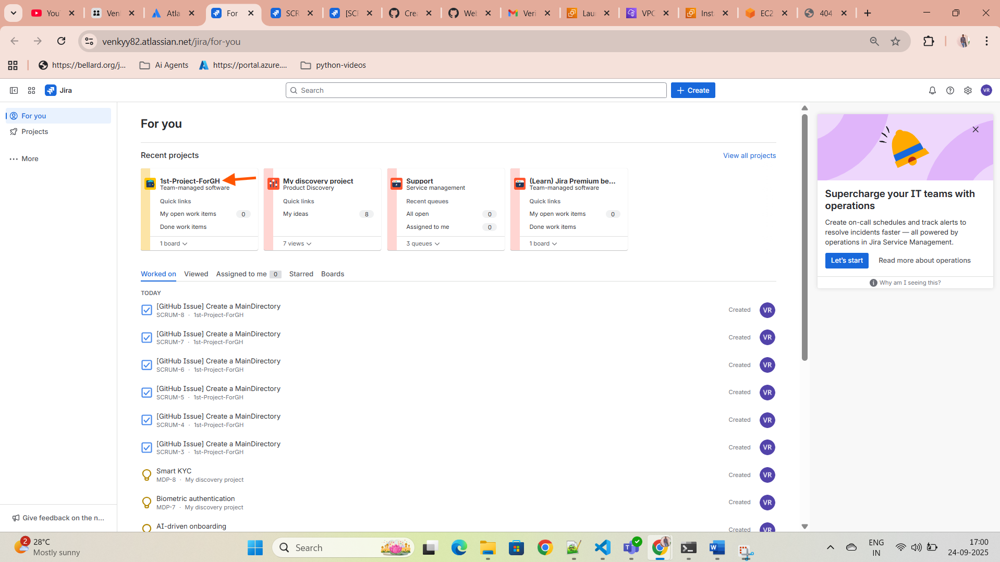

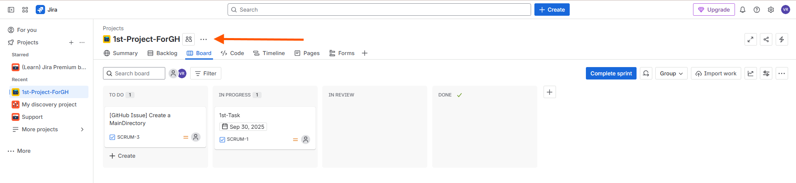

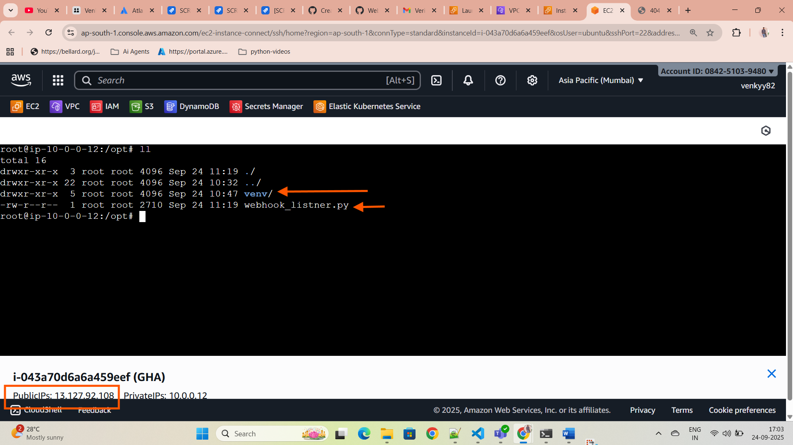


#### Creation of API token in JIRA:

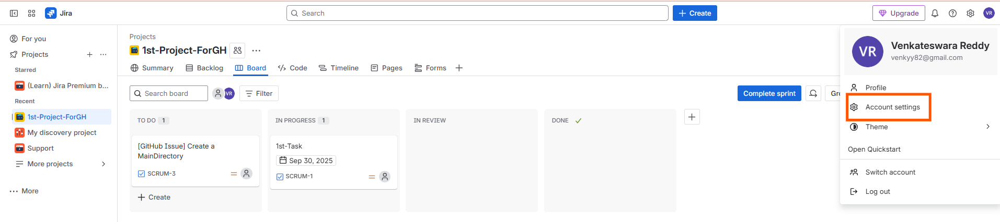

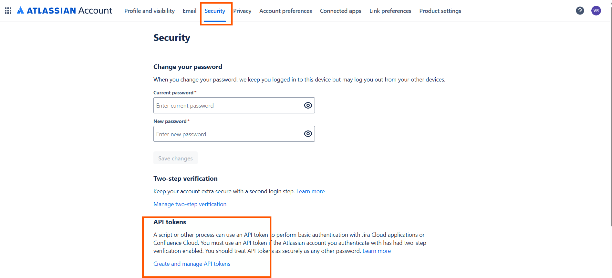

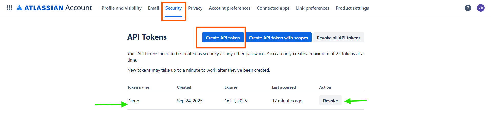


#### Fetching Project Key of our current project:


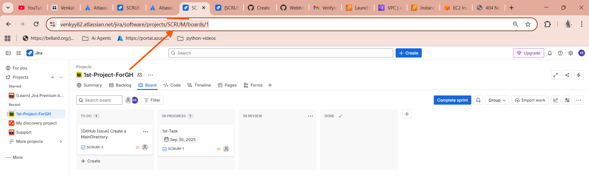


---

## 🧑‍💻 Setup Instructions

### 1. 🔐 Jira Configuration

| Key               | Value                                |
| ----------------- | ------------------------------------ |
| **Email**         | `venkyy82@gmail.com`                 |
| **API Token**     | *(Generated from Atlassian account)* |
| **Jira Base URL** | `https://venkyy82.atlassian.net`     |
| **Project Key**   | `SCRUM`                              |

> 💡 Project key can be found in your Jira project URL or settings.

---

### 2. 🖥️ Python Webhook Server (`webhook_listener.py`)

#### ✅ Final Code


```
webhook_listner.py
```

---

### 3. 📦 Install Dependencies (on EC2)

```bash
sudo apt update
sudo apt install python3-pip -y
pip3 install flask requests
```

---

### 4. 🚀 Run the Webhook Server

```bash
cd /opt
python3 webhook_listener.py
```

> 📌 Now listening on: `http://13.127.92.108:5000/webhook`

---

### 5. 🌐 Configure GitHub Webhook

1. Go to your GitHub repo (e.g. `demo`)
2. Navigate to **Settings → Webhooks → Add webhook**
3. Fill the form:

| Field        | Value                               |
| ------------ | ----------------------------------- |
| Payload URL  | `http://13.127.92.108:5000/webhook` |
| Content type | `application/json`                  |
| Secret       | *(Leave blank for now)*             |
| Events       | Select **"Issue comments"** only    |

Click **Add webhook**


#### Creating GitHub WebHook


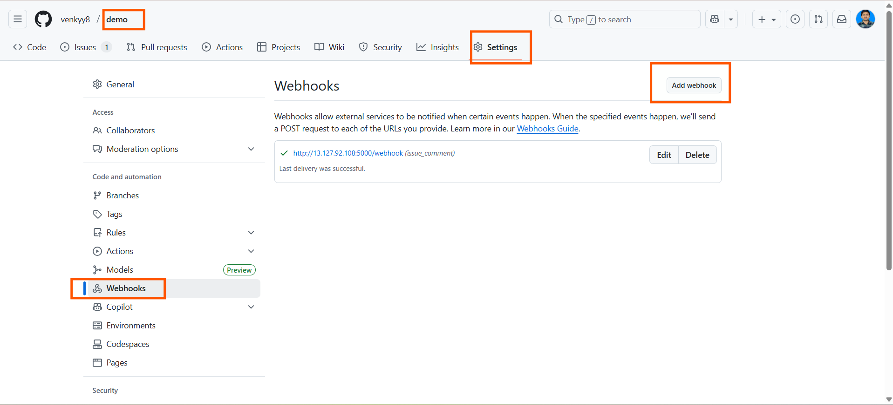

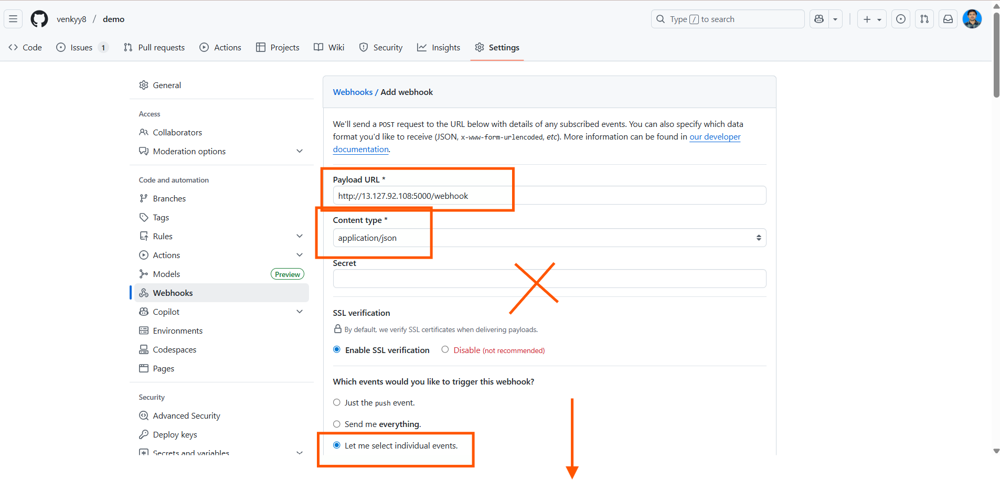

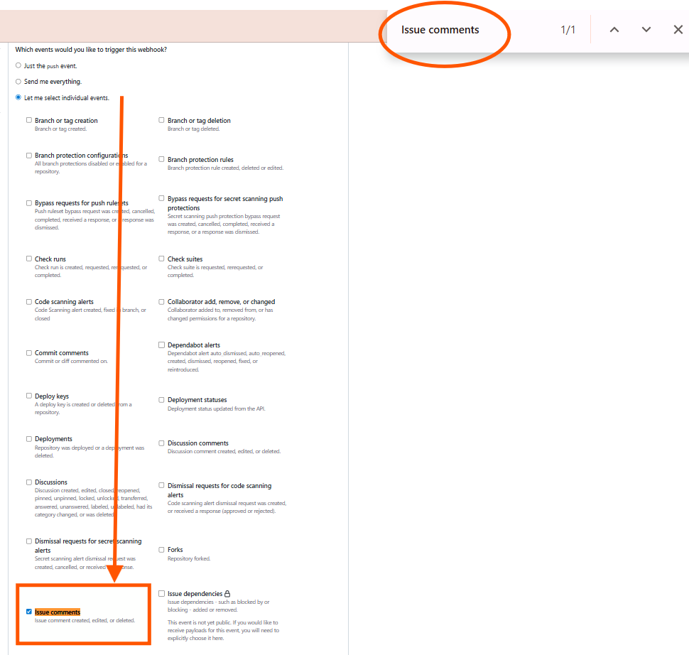


---

## ✅ How It Works

* You comment `/jira` on a GitHub issue.
* GitHub sends a webhook POST to your Flask server.
* Your Python script checks if the comment is **exactly** `/jira`.
* If yes, it calls Jira API to create a **Task** in the `SCRUM` project.
* The issue title and link are included in the Jira ticket.


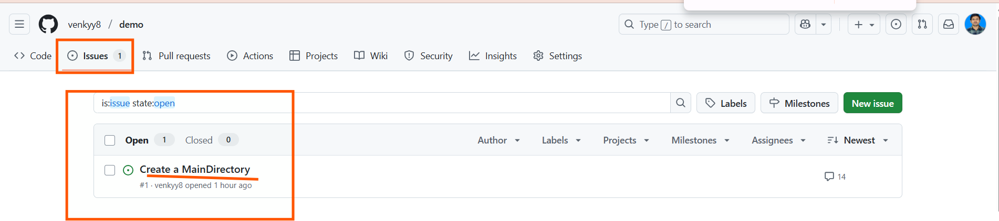

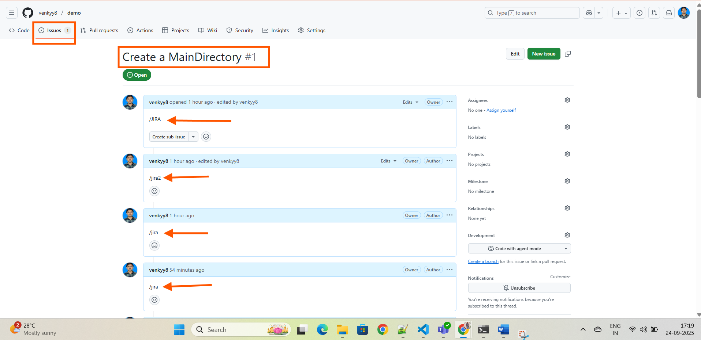

---

## 📌 Command Match Rules

| Input Comment     | Will Create Ticket? |
| ----------------- | ------------------- |
| `/jira`           | ✅ Yes               |
| `   /jira  `      | ✅ Yes               |
| `/jira1`          | ❌ No                |
| `/JIRA now`       | ❌ No                |
| `please do /jira` | ❌ No                |
| `hello /jira`     | ❌ No                |


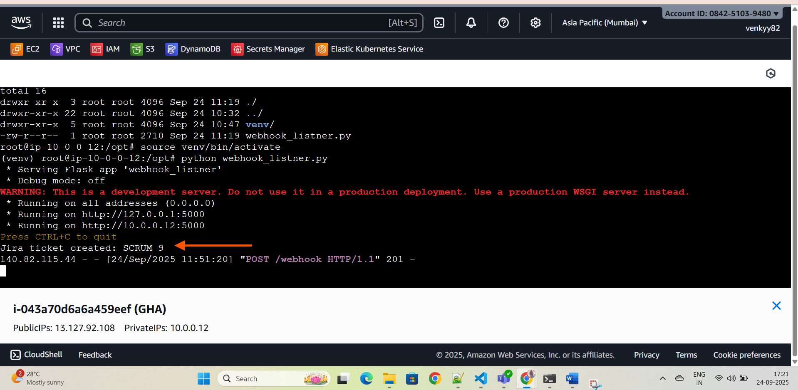


---

## 🛑 Security Notes (For Production)

> For practice it's okay, but in real deployment:

* 🔒 Never hardcode Jira tokens — use environment variables.
* 🔒 Validate GitHub webhook signature (`X-Hub-Signature`).
* 🔒 Use HTTPS with domain & SSL (not public IP).
* 🛠️ Use a WSGI server like **Gunicorn** or **uWSGI** (not Flask's dev server).

---

## 🧪 To Test

1. Go to any issue in your GitHub repo.
2. Add comment:

   ```
   /jira
   ```
3. Check EC2 logs — you should see:

   ```
   Jira ticket created: SCRUM-123
   ```
4. Check Jira board:
   `https://venkyy82.atlassian.net/jira/software/projects/SCRUM/boards/1`

---

## 🧰 Optional Improvements

* [ ] Post back to GitHub confirming ticket creation
* [ ] Allow custom summary via comment like `/jira summary: Fix login`
* [ ] Support multiple Jira issue types (Bug, Story, Task)
* [ ] Use logging instead of `print`
* [ ] Run as background service using `systemd`
* [ ] Use `.env` instead of hardcoding sensitive values

---

## 👨‍🔧 Author / Maintainer

* Name: **Venkateswara Reddy**
* Email: `venkyy82@gmail.com`
* Jira URL: [venkyy82.atlassian.net](https://venkyy82.atlassian.net)
* GitHub Repo: `demo`

---
